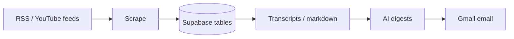
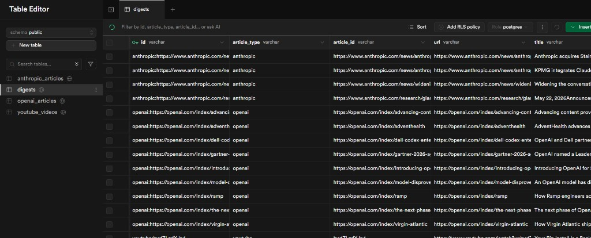
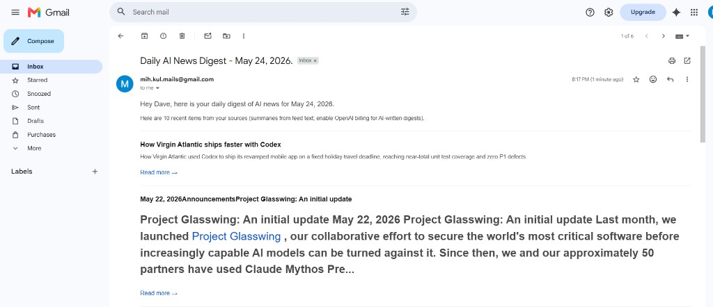

# AI News Aggregator

Personal pipeline that collects AI news from YouTube, OpenAI, and Anthropic, stores it in **Supabase (PostgreSQL)**, summarizes items, and sends a **daily Gmail digest**.

## What it does

1. **Scrape** — RSS feeds + YouTube channel feeds (configurable time window)
2. **Enrich** — YouTube transcripts, Anthropic full-page markdown
3. **Digest** — Summaries in the `digests` table (OpenAI, or fallback excerpts)
4. **Email** — Top stories ranked for your profile, delivered to your inbox

## Architecture



## Screenshots

| Supabase `digests` table | Gmail digest |
|--------------------------|--------------|
|  |  |

## Project structure

```
ai-news-aggregator/
├── main.py                 # Full pipeline entry point
├── pyproject.toml          # Dependencies (uv)
├── uv.lock                 # Locked versions for uv sync
├── requirements.txt        # Top-level deps (pip alternative)
├── app/
│   ├── config.py           # Channels, SCRAPE_HOURS, feature flags
│   ├── runner.py           # Scrape-only
│   ├── daily_runner.py     # Scrape → process → email
│   ├── scrapers/           # youtube, openai, anthropic
│   ├── services/           # transcripts, markdown, digests, email
│   ├── agent/              # OpenAI digest, curator, email agents
│   ├── database/           # SQLAlchemy models + repository
│   └── profiles/           # User interests for ranking
├── scripts/
│   ├── run_daily.ps1       # Run full pipeline (Task Scheduler)
│   └── register_scheduled_task.ps1
├── docs/images/            # README screenshots
└── app/example.env         # Copy to .env (not committed)
```

## Database tables

| Table | Purpose |
|-------|---------|
| `youtube_videos` | Scraped videos + transcripts |
| `openai_articles` | OpenAI blog RSS items |
| `anthropic_articles` | Anthropic feeds + fetched markdown |
| `digests` | Summaries used for the email |

## Prerequisites

- **Python 3.12+**
- **[uv](https://docs.astral.sh/uv/)** (recommended)
- **Supabase** project (Postgres connection)
- **OpenAI API key** with billing (for AI digests; optional fallback mode)
- **Gmail** + [App Password](https://myaccount.google.com/apppasswords) for sending

## Setup

```bash
git clone https://github.com/Mihirkool/ai-news-aggregator.git
cd ai-news-aggregator

# Install uv: https://docs.astral.sh/uv/getting-started/installation/
uv sync

cp app/example.env .env
# Edit .env: POSTGRES_*, OPENAI_API_KEY, MY_EMAIL, APP_PASSWORD

uv run python -m app.database.create_tables
```

### Environment variables (`.env`)

| Variable | Description |
|----------|-------------|
| `POSTGRES_*` | Supabase database password & host |
| `OPENAI_API_KEY` | For AI summaries and email ranking |
| `MY_EMAIL` / `APP_PASSWORD` | Gmail sender |
| `SCRAPE_HOURS` | How far back to fetch (default `168` = 7 days) |
| `USE_FALLBACK_DIGESTS` | `true` = feed excerpts only (no OpenAI quota needed) |

YouTube channels are listed in `app/config.py` (`YOUTUBE_CHANNELS`).

## Run

```bash
# Scrape only → fills youtube_videos, openai_articles, anthropic_articles
uv run python -m app.runner

# Full pipeline → scrape, enrich, digests, email
uv run python main.py

# Custom scrape window (hours) and email top N
uv run python main.py 168 10
```

**Windows — daily schedule (optional):**

```powershell
.\scripts\register_scheduled_task.ps1   # 8:00 AM daily
.\scripts\run_daily.ps1                 # test run now
```

### Without uv (pip)

```bash
python -m venv .venv
.venv\Scripts\activate          # Windows
# source .venv/bin/activate     # macOS/Linux
pip install -r requirements.txt
python -m app.database.create_tables
python main.py
```

## Push to GitHub

From the project folder (`.env` and `.venv` are gitignored):

```bash
git init
git add .
git status                    # confirm .env and .venv are NOT listed
git commit -m "Initial commit: AI news aggregator pipeline"
git branch -M main
git remote add origin https://github.com/Mihirkool/ai-news-aggregator.git
git push -u origin main
```

If the remote already exists and the repo is empty:

```bash
git remote add origin https://github.com/Mihirkool/ai-news-aggregator.git
git push -u origin main
```

## License

MIT (or add your license of choice)
